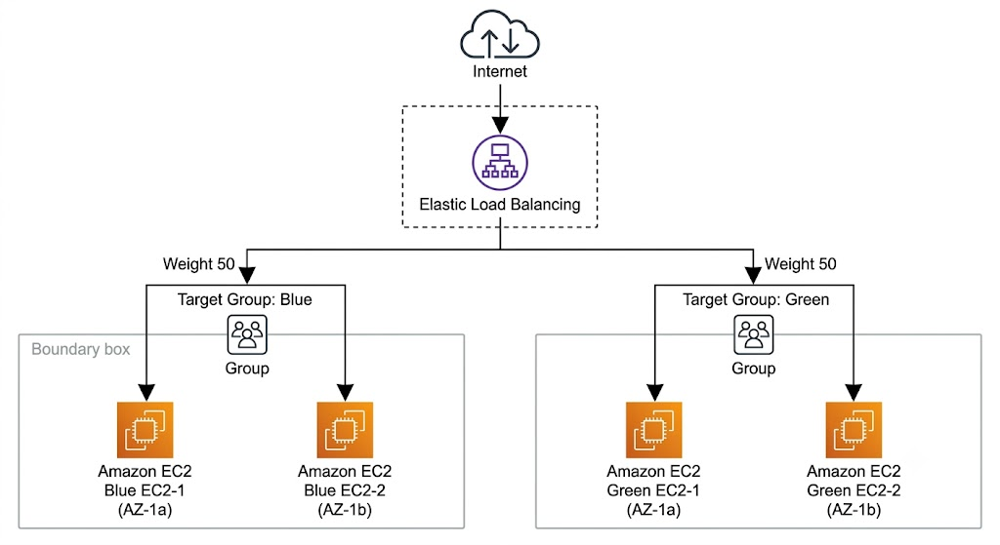
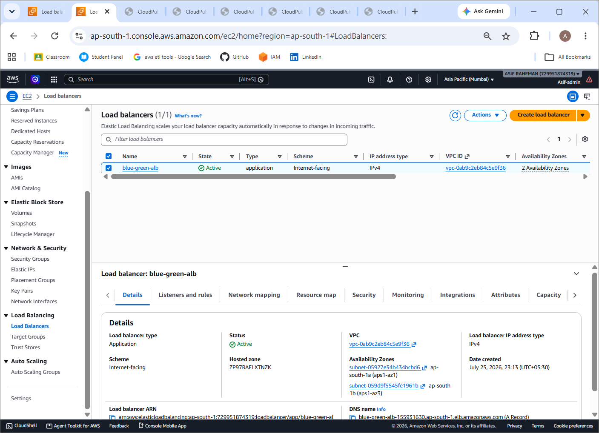
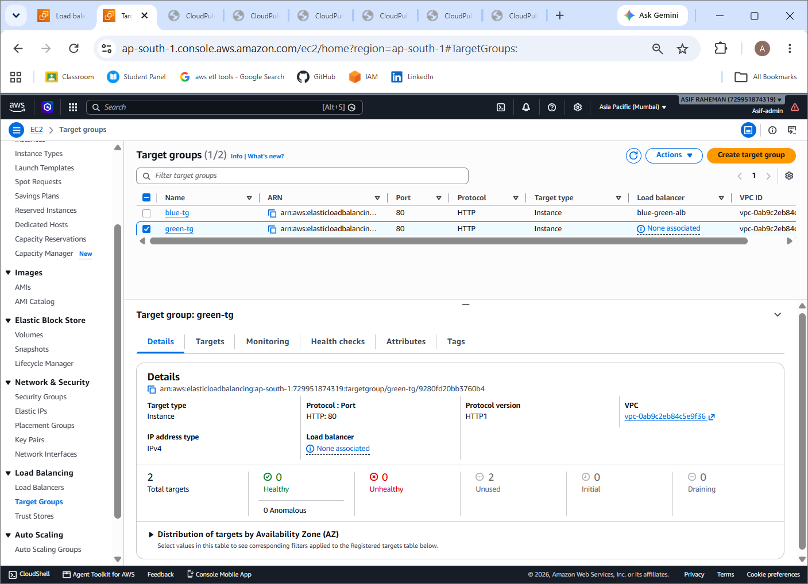

# AWS Blue-Green Deployment using Application Load Balancer

## Project Overview

This project demonstrates a production-inspired Blue-Green Deployment strategy on Amazon Web Services (AWS) using an Application Load Balancer (ALB). Two independent environments (Blue and Green) were deployed across multiple Availability Zones to enable near zero-downtime application releases. Traffic was gradually shifted between environments using ALB weighted target groups before completing the deployment.

---

## Architecture

                               
                                                               
- Internet-facing Application Load Balancer
- Blue Environment (2 EC2 Instances)
- Green Environment (2 EC2 Instances)
- Blue Target Group
- Green Target Group
- Multi-AZ Deployment
- Weighted Traffic Routing
- Health Checks

---

## AWS Services Used

- Amazon EC2
- Application Load Balancer (ALB)
- Target Groups
- Launch Templates
- Amazon VPC
- Public Subnets
- Security Groups
- Amazon CloudWatch (Health Monitoring)

---

## Features

- Blue-Green Deployment
- Zero/Near-Zero Downtime Deployment
- Multi-AZ High Availability
- Health Check Validation
- Weighted Traffic Shifting
- Instant Rollback Capability
- Production-Inspired Deployment Strategy

---

## Deployment Workflow

1. Create Blue Launch Template
2. Launch Blue Environment
3. Create Blue Target Group
4. Create Application Load Balancer
5. Verify Blue Environment
6. Create Green Launch Template
7. Launch Green Environment
8. Create Green Target Group
9. Verify Green Health Checks
10. Shift Traffic (50% Blue / 50% Green)
11. Complete Traffic Cutover (100% Green)

---

## Traffic Migration

Initial State

Blue → 100%

Green → 0%

↓

Testing Phase

Blue → 50%

Green → 50%

↓

Production

Blue → 0%

Green → 100%

---

## Learning Outcomes

- Application Load Balancer Configuration
- Launch Templates
- Target Groups
- Health Checks
- Weighted Routing
- Blue-Green Deployment
- Traffic Management
- High Availability
- Zero-Downtime Deployment

---

# Screenshots

## Architecture

## Blue Environment

## Green Environment

## Application Load Balancer

## Target Groups

## Traffic Shift (50/50)

## Author

SK ASIF RAHEMAN